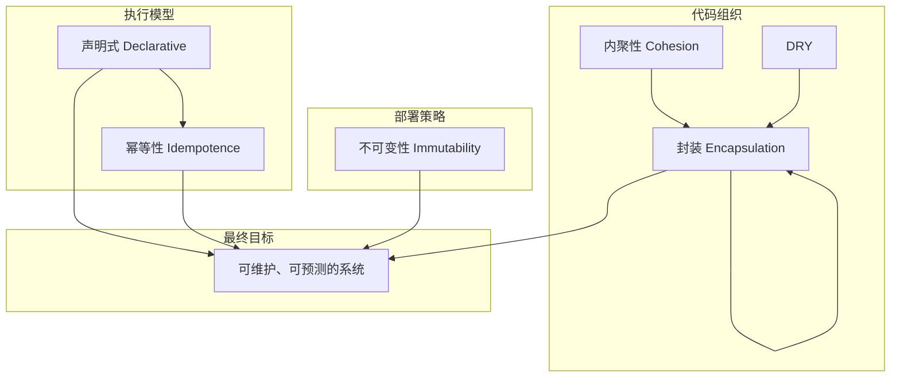
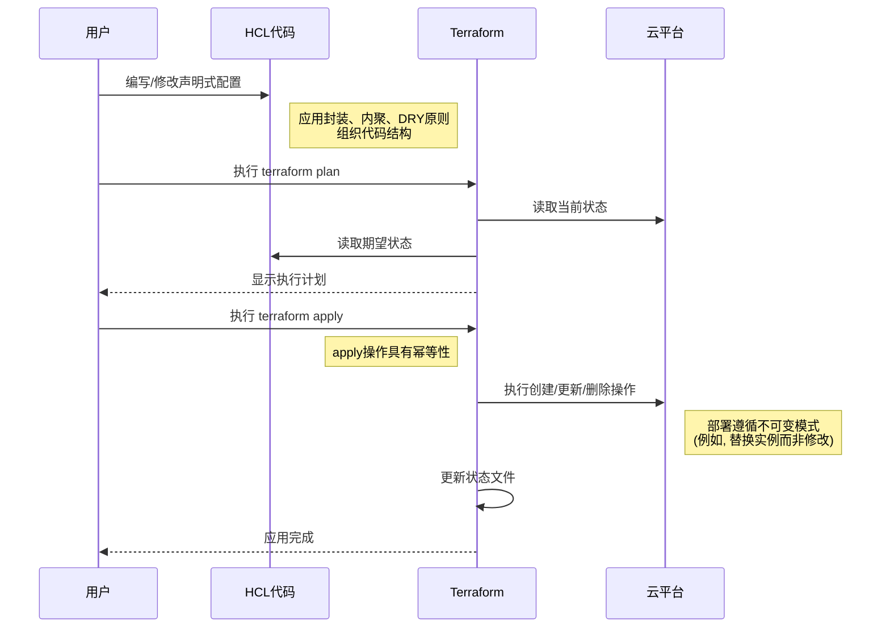

# 核心原则

Terraform 的设计哲学借鉴了软件工程领域的许多核心原则。理解这些原则不仅能帮助你更高效地使用 Terraform，还能让你编写出更健壮、可维护和可扩展的基础设施代码。

## 1. 声明式 (Declarative)
### 概念定义
**声明式** 方法关注于 **“目标是什么”**，而不是“如何实现”。你只需定义期望的系统状态，而由工具自己决定如何达到这个状态。

这与**命令式 (Imperative)** 方法形成对比，后者需要你详细描述达到目标所需的每一个步骤。

*   **现实世界类比**：
    *   **声明式**：在餐厅点菜，你告诉服务员你想要“一份牛排，五分熟”，而不用关心厨师如何采购、切配、烹饪。
    *   **命令式**：你提供一份详细的烹饪食谱，指导厨师完成每一个步骤，从“将烤箱预热到200度”到“煎牛排每面3分钟”。

### 在 Terraform 中的体现
Terraform 是一个纯粹的声明式工具。你在 `.tf` 文件中定义期望的基础设施资源（如虚拟机、网络、数据库），然后 Terraform 会：
1.  **读取期望状态**：解析你的配置文件。
2.  **检查当前状态**：通过状态文件（`terraform.tfstate`）和云平台 API 了解现有资源。
3.  **生成执行计划**：对比期望状态和当前状态，计算出需要执行的最小操作集（创建、更新或删除）。

这个特性使得你无需关心复杂的操作顺序和依赖关系，极大地简化了基础设施管理。

## 2. 幂等性 (Idempotence)
### 概念定义
**幂等性**指一个操作无论执行一次还是多次，其产生的结果都完全相同。

*   **现实世界类比**：
    *   **幂等**：按电梯的关门按钮。第一次按下后，电梯门开始关闭。之后无论再按多少次，电梯门都只是保持关闭状态，不会有新的变化。
    *   **非幂等**：在银行ATM机上执行存款操作。每执行一次，你的账户余额都会增加，结果随执行次数而改变。

### 在 Terraform 中的体现
Terraform 的核心工作流（`terraform apply`）是幂等的。当你定义了期望状态（例如，“我需要一个 t2.micro 类型的 EC2 实例”）并执行 `apply`：
*   **第一次执行**：如果实例不存在，Terraform 会创建它。
*   **后续执行**：如果实例已按配置存在，Terraform 不会执行任何操作。如果实例的配置（如标签）与代码不符，Terraform 会更新它以匹配期望状态。

### 重要性
幂等性是基础设施自动化的基石。它允许你安全地、反复地运行自动化脚本，而不用担心产生意外的副作用，确保系统总是收敛到你所定义的期望状态。

## 3. 不可变性 (Immutability)
### 概念定义
**不可变基础设施**是一种部署模式，其中服务器或其他基础设施组件在部署后永远不会被修改。如果需要更新、修复或修改，就用一个包含最新变更的新版本来替换旧的组件。

这与**可变基础设施 (Mutable Infrastructure)** 相反，后者允许管理员直接登录服务器进行修改和更新。

*   **现实世界类比**：
    *   **不可变**：一张冲洗出来的照片。你不能修改它，如果想改变构图或人物，只能重新拍一张。
    *   **可变**：一块白板。你可以随时在上面擦写、修改内容。

### 实现方式
在 Terraform 中，不可变性通常通过以下方式实现：
*   **不可变镜像**：使用 Packer 等工具预先构建包含所有应用程序和配置的虚拟机镜像（AMI）。每次更新都是构建一个新镜像，并用它来启动新实例，替换旧实例。
*   **资源替换**：当修改了资源的某个无法原地更新的属性（如实例类型）时，Terraform 会销毁旧资源并创建一个新资源来代替它。

### 优势
*   **消除配置漂移**：防止因手动修改导致的环境不一致。
*   **简化回滚**：回滚就像部署旧版本的镜像一样简单可靠。
*   **提高部署可预测性**：每个环境都从一个已知的、干净的状态开始。

## 4. 封装 (Encapsulation)
### 概念定义
**封装**是软件工程的一项基本原则，意味着将数据（属性）和操作数据的方法（行为）捆绑在一起，并对外部世界隐藏其内部实现细节。外部只需通过一个定义良好的接口与之交互。

### Terraform 模块设计
在 Terraform 中，**模块 (Module)** 是实现封装的主要方式。一个好的模块应该：
*   **定义清晰的接口**：通过 `variable` 定义输入参数，通过 `output` 定义输出结果。
*   **隐藏实现细节**：模块的使用者无需关心内部是如何创建和配置资源的，只需提供必要的输入即可。
*   **可重用**：一个封装良好的模块（如网络 VPC 模块、数据库模块）可以在多个项目中复用。

例如，一个 `vpc` 模块封装了创建 VPC、子网、路由表、安全组等所有复杂逻辑。使用者只需调用该模块并传入网络地址范围等几个简单参数，就能获得一个功能完整的网络环境。

## 5. 内聚性 (Cohesion)
### 概念定义
**内聚性**衡量一个模块内部各个元素之间相关联的程度。
*   **高内聚**：模块内的所有元素（资源、变量等）都为了一个共同的目标而工作。例如，一个 `aws-vpc` 模块只处理与 VPC 相关的资源。
*   **低内聚**：模块内包含了许多不相关的功能。例如，一个模块既创建 VPC，又部署应用程序，还配置 DNS。

*   **现实世界类比**：
    *   **高内聚**：一个厨房里的所有工具都用于烹饪。
    *   **低内聚**：一个抽屉里既有螺丝刀，又有餐具，还有孩子的玩具。

### 基础设施设计中的应用
在设计 Terraform 模块时，应追求**高内聚**：
*   **职责单一**：让每个模块只做一件事，并把它做好。
*   **易于维护**：当需要修改网络配置时，你确切地知道应该去哪个模块。
*   **减少耦合**：高内聚的模块通常与其他模块的依赖关系更少，更容易被替换或重构。

## 6. DRY (Don't Repeat Yourself)
### 概念定义
**DRY** 是一个旨在减少信息重复的软件开发原则。其核心思想是“系统中的每一部分知识都必须有一个单一、明确、权威的表示。”

### 在基础设施代码中的应用与权衡
在 Terraform 中，DRY 主要通过模块、变量和 `for_each` 等循环结构来实现。

然而，在基础设施领域，过度追求 DRY 可能会导致**错误的抽象**。有时，适度的重复（常被称为 **WET - Write Everything Twice**）反而能让代码更清晰、更易于理解和调试。

**权衡原则**：
*   **优先考虑清晰度**：如果为了避免重复而创建的抽象层让代码变得难以理解，那么宁愿选择重复。
*   **为真正的重复创建模块**：当你发现自己正在跨多个项目或环境复制粘贴几乎完全相同的代码块时，这通常是创建可重用模块的最佳时机。

## 核心原则关系图

这些原则并非孤立存在，而是相互关联、共同构建了一个健壮的 IaC 实践体系。

## 原则在 Terraform 工作流中的应用

下图展示了这些核心原则在典型的 Terraform 工作流中是如何应用的。

## 实施检查清单
1. [ ] **声明式**：我的代码是否只定义了“什么”，而不是“如何做”？
2. [ ] **幂等性**：我能否安全地反复运行 `terraform apply` 而不产生意外的副作用？
3. [ ] **不可变性**：我的更新策略是替换旧资源，还是在现有资源上进行修改？
4. [ ] **封装**：我是否将相关的资源和逻辑封装在模块中，并提供了清晰的输入/输出接口？
5. [ ] **内聚性**：我的模块是否职责单一、高度内聚？
6. [ ] **DRY**：我是在为真正的代码重复创建模块，还是在进行不成熟的抽象？代码的清晰度是否足够？

## 进一步学习资源
*   **官方文档**: [Terraform Modules](https://www.terraform.io/docs/language/modules/index.html)
*   **经典著作**: 《The Pragmatic Programmer》(DRY原则出处), 《Clean Architecture》
*   **在线文章**: Gruntwork - "5 Lessons Learned From Writing Over 300,000 Lines of Infrastructure Code"