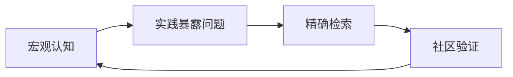

# Terraform 信息探索与学习路径

当面对未知概念（如"Data Source"）时，遵循以下结构化流程可高效突破知识盲区：

## 1️⃣ 建立宏观认知
> **目标**：理解工具的设计哲学和核心构建块

```markdown
### 实践步骤：
1. **阅读核心概念文档**  
   - 访问 [Terraform 官方文档](https://developer.hashicorp.com/terraform/docs)
   - 精读 "Core Concepts" 部分，重点关注：
     - `Providers` (提供者)
     - `Resources` (资源)
     - `Variables` (变量)
     - `Data Sources` (数据源) 👈 关键概念
     - `State` (状态)

2. **扫描 Provider 功能矩阵**  
   - 在 [Azure Provider 文档](https://registry.terraform.io/providers/hashicorp/azurerm/latest/docs) 中：
   - 查看顶部导航栏的分类（如 "Resources" 和 "Data Sources"）
   - 通过分类名称推测功能（如：数据源 ≈ 读取现有信息）
```

## 2️⃣ 实践驱动学习
> **目标**：通过动手暴露知识缺口

```terraform
# 示例：触发学习需求的情境
resource "azurerm_key_vault" "example" {
  name                = "mykeyvault"
  location            = "eastus"
  resource_group_name = "my-rg"
  
  # 此处引发疑问：tenant_id 应该硬编码吗？
  tenant_id = "d6f1e6d4-8d2f-4e2f-925f-b6576e472e63" 
}
```

### 探索工具：
```bash
# 使用交互式控制台发现可用属性
$ terraform console

> data.azurerm_client_config.current
{
  "client_id" = "xxxxx-xxxx-xxxx-xxxx-xxxxxxx",
  "object_id" = "xxxxx-xxxx-xxxx-xxxx-xxxxxxx",
  "subscription_id" = "xxxxx-xxxx-xxxx-xxxx-xxxxxxx",
  "tenant_id" = "d6f1e6d4-8d2f-4e2f-925f-b6576e472e63" 👈 发现目标属性
}
```

## 3️⃣ 精确信息检索
> **目标**：定位具体解决方案

```markdown
### 关键词组合策略：
| 知识阶段       | 搜索关键词示例                     | 预期结果                |
|----------------|-----------------------------------|------------------------|
| 概念模糊期     | `terraform avoid hardcoding ids`  | 发现"动态值"概念       |
| 概念明确后     | `terraform get current tenant_id` | 直达`azurerm_client_config` |
| 解决方案验证   | `azurerm_client_config example`   | 查看官方示例代码       |
```

## 4️⃣ 社区与协作
> **目标**：通过集体智慧深化理解

```markdown
### 推荐资源：
1. **GitHub 代码考古**  
   ```url
   https://github.com/search?q=azurerm_client_config+path%3A*.tf&type=code
   ```
   - 学习真实项目中的使用模式
   - 观察上下文配置（如认证、变量传递）

2. **社区问答**  
   - [HashiCorp 论坛](https://discuss.hashicorp.com/c/terraform-core)
   - [Stack Overflow #terraform 标签](https://stackoverflow.com/questions/tagged/terraform)
   - 提问模板：  
     "如何动态获取 __[具体属性]__ 代替硬编码？  
     我已尝试 __[描述探索过程]__，但尚未找到解决方案"
```

## 📌 总结：学习飞轮


> 此文档根据实际学习痛点创建于：2025-08-08  
> 最新验证环境：Terraform v1.8 + AzureRM Provider 3.80