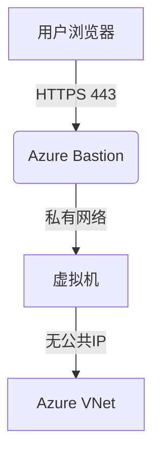

# Azure Bastion安全访问指南

## 概述
Azure Bastion提供安全的RDP/SSH连接，无需公共IP地址暴露虚拟机。本指南介绍如何配置和使用Azure Bastion服务。

## 架构优势


## 部署步骤

### 1. 创建Bastion子网
```hcl:network.tf
resource "azurerm_subnet" "bastion" {
  name                 = "AzureBastionSubnet"
  resource_group_name  = azurerm_resource_group.main.name
  virtual_network_name = azurerm_virtual_network.main.name
  address_prefixes     = ["10.0.100.0/27"]
}
```

### 2. 部署Bastion主机
```hcl:bastion.tf
resource "azurerm_bastion_host" "main" {
  name                = "secure-bastion"
  location            = azurerm_resource_group.main.location
  resource_group_name = azurerm_resource_group.main.name
  
  ip_configuration {
    name                 = "configuration"
    subnet_id            = azurerm_subnet.bastion.id
    public_ip_address_id = azurerm_public_ip.bastion.id
  }
}
```

### 3. 配置网络安全组
```hcl:nsg.tf
# 允许来自Internet的HTTPS访问
resource "azurerm_network_security_rule" "bastion_in" {
  name                       = "AllowHttpsInbound"
  priority                   = 100
  direction                  = "Inbound"
  access                     = "Allow"
  protocol                   = "Tcp"
  source_port_range          = "*"
  destination_port_range     = "443"
  source_address_prefix      = "Internet"
  destination_address_prefix = "*"
}

# 拒绝所有其他入站流量
resource "azurerm_network_security_rule" "deny_all_in" {
  name                       = "DenyAllInbound"
  priority                   = 4096
  direction                  = "Inbound"
  access                     = "Deny"
  protocol                   = "*"
  source_port_range          = "*"
  destination_port_range     = "*"
  source_address_prefix      = "*"
  destination_address_prefix = "*"
}
```

## 连接方法

### 通过Azure门户连接
1. 导航到目标虚拟机
2. 选择"连接" > "Bastion"
3. 输入凭据后安全连接

### 通过Terraform获取连接URL
```hcl:outputs.tf
output "bastion_connection_url" {
  value = "https://portal.azure.com/#resource${azurerm_bastion_host.main.id}/connect"
}
```

## 高级配置

### 1. 基于角色的访问控制(RBAC)
```hcl:rbac.tf
resource "azurerm_role_assignment" "bastion_operator" {
  scope                = azurerm_bastion_host.main.id
  role_definition_name = "Azure Bastion Operator"
  principal_id         = azuread_user.operator.object_id
}
```

### 2. 诊断日志集成
```hcl:monitoring.tf
resource "azurerm_monitor_diagnostic_setting" "bastion_logs" {
  name               = "bastion-diagnostics"
  target_resource_id = azurerm_bastion_host.main.id
  log_analytics_workspace_id = azurerm_log_analytics_workspace.main.id
  
  enabled_log {
    category = "BastionAuditLogs"
  }
}
```

### 3. 自定义DNS配置
```hcl:dns.tf
resource "azurerm_dns_a_record" "bastion" {
  name                = "bastion"
  zone_name           = azurerm_dns_zone.main.name
  resource_group_name = azurerm_resource_group.main.name
  ttl                 = 300
  records             = [azurerm_public_ip.bastion.ip_address]
}
```

## 最佳实践
1. **网络隔离**：将Bastion部署在专用VNet中
2. **多因素认证**：集成Azure AD MFA
3. **会话记录**：启用会话记录进行审计
4. **自动缩放**：配置Bastion主机自动扩展
5. **私有链接**：使用Private Link增强安全性