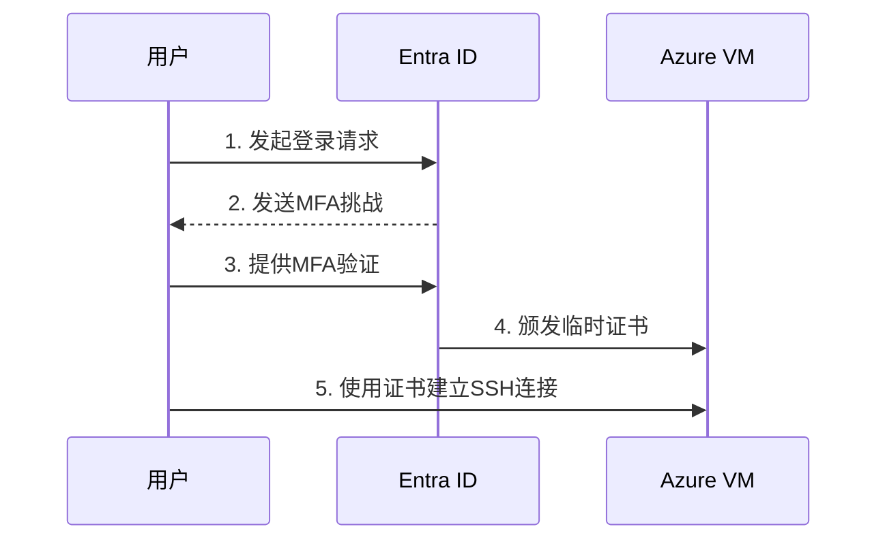

# Entra ID身份认证与VM扩展指南

## 概述
本指南介绍如何使用Microsoft Entra ID（原Azure AD）实现Linux虚拟机无密码登录，并配置相关VM扩展增强安全和管理能力。

## 认证流程


## 核心组件配置

### 1. 启用Entra ID认证
```hcl:entra.tf
resource "azurerm_linux_virtual_machine" "entra_vm" {
  # ...标准虚拟机配置...
  
  identity {
    type = "SystemAssigned"
  }

  admin_username = "azureuser"
  disable_password_authentication = true
}
```

### 2. 安装AADSSH扩展
```hcl:extensions.tf
resource "azurerm_virtual_machine_extension" "aad_ssh" {
  name                 = "AADSSHLoginForLinux"
  virtual_machine_id   = azurerm_linux_virtual_machine.entra_vm.id
  publisher            = "Microsoft.Azure.ActiveDirectory"
  type                 = "AADSSHLoginForLinux"
  type_handler_version = "1.0"
}
```

## RBAC权限配置
```hcl:rbac.tf
# 允许用户通过Entra ID登录虚拟机
resource "azurerm_role_assignment" "vm_login" {
  scope                = azurerm_linux_virtual_machine.entra_vm.id
  role_definition_name = "Virtual Machine User Login"
  principal_id         = data.azuread_user.developer.object_id
}

# 允许管理员权限
resource "azurerm_role_assignment" "vm_admin" {
  scope                = azurerm_linux_virtual_machine.entra_vm.id
  role_definition_name = "Virtual Machine Administrator Login"
  principal_id         = data.azuread_user.admin.object_id
}
```

## 登录流程

### 1. 安装Azure CLI扩展
```bash
az extension add --name ssh
```

### 2. 使用Entra ID登录
```bash
az ssh vm --name my-vm --resource-group my-rg
```

### 3. 检查登录状态
```bash
sudo cat /var/log/azure/AADSSHLoginForLinux/audit.log
```

## 实用VM扩展

### 1. 诊断扩展
```hcl:monitoring.tf
resource "azurerm_virtual_machine_extension" "diagnostics" {
  name                 = "LinuxDiagnostic"
  virtual_machine_id   = azurerm_linux_virtual_machine.entra_vm.id
  publisher            = "Microsoft.Azure.Diagnostics"
  type                 = "LinuxDiagnostic"
  type_handler_version = "3.0"
}
```

### 2. 自定义脚本扩展
```hcl:custom_script.tf
resource "azurerm_virtual_machine_extension" "init_script" {
  name                 = "CustomScript"
  virtual_machine_id   = azurerm_linux_virtual_machine.entra_vm.id
  publisher            = "Microsoft.Azure.Extensions"
  type                 = "CustomScript"
  type_handler_version = "2.1"

  settings = jsonencode({
    "commandToExecute" = "sudo apt-get update && sudo apt-get install -y nginx"
  })
}
```

### 3. Azure Monitor代理
```hcl:monitor.tf
resource "azurerm_virtual_machine_extension" "ama" {
  name                 = "AzureMonitorAgent"
  virtual_machine_id   = azurerm_linux_virtual_machine.entra_vm.id
  publisher            = "Microsoft.Azure.Monitor"
  type                 = "AzureMonitorLinuxAgent"
  type_handler_version = "1.0"
}
```

## 最佳实践
1. **条件访问策略**：配置基于位置的访问限制
2. **生命周期管理**：使用Azure策略自动更新扩展
3. **审计日志**：启用Entra ID登录审计
4. **最小权限原则**：使用自定义RBAC角色
5. **扩展监控**：设置扩展部署状态警报

## 故障排除
**问题**：SSH登录失败 "No matching host key"  
**解决步骤**：
1. 验证VM是否安装了AADSSH扩展
2. 检查RBAC权限分配
3. 确认用户已加入Entra ID租户
4. 查看扩展日志：`sudo journalctl -u aadsshlogin`