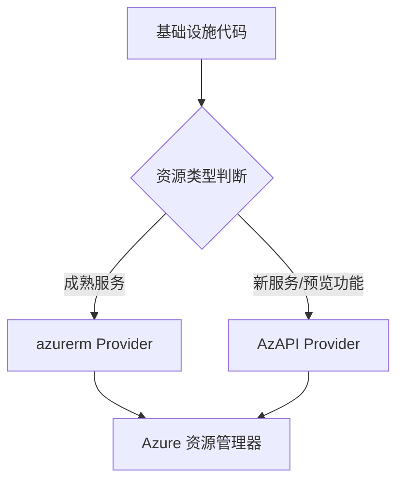
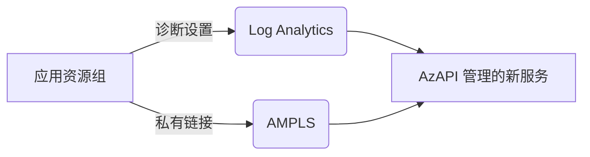

# AzAPI Provider 架构设计

## 1. 企业架构中的定位

AzAPI Provider 作为 Terraform Azure 生态系统的补充组件，主要服务于以下场景：
- **新服务快速集成**：在新 Azure 服务发布的 Day Zero 提供支持
- **技术预览接入**：为预览功能提供早期接入能力
- **特殊版本需求**：支持特定 API 版本的资源管理

## 2. 与 azurerm Provider 的协同架构



## 3. 分层架构设计

### 3.1 平台层 (Platform)
- 使用 AzAPI 部署共享服务：
  - Log Analytics 工作区
  - Azure Monitor Private Link Scope (AMPLS)
  - Private DNS Zones

### 3.2 环境层 (Environment)
- 混合使用 azurerm 和 AzAPI：
  ```hcl
  module "network" {
    source  = "Azure/avm-ptn-network/azurerm"
    version = "1.0.0" # 使用 AVM 模块
  }

  resource "azapi_resource" "new_feature" {
    type = "Microsoft.New/feature@2025-01-01-preview"
    # 新功能配置
  }
  ```

### 3.3 应用层 (Application)
- 推荐使用 Kubernetes 原生工具管理应用部署
- 通过 AzAPI 补充管理新发布的 Azure 服务集成

## 4. 共享服务集成模式



## 5. 状态管理最佳实践

- **工作区隔离**：为每个环境使用独立 Terraform 工作空间
- **状态文件分离**：
  ```hcl
  terraform {
    backend "azurerm" {
      key = "env:/${terraform.workspace}/azapi-platform.tfstate"
    }
  }
  ```
- **敏感数据处理**：避免在 AzAPI 资源定义中硬编码敏感值

## 6. 版本控制策略

| 组件 | 策略 |
|------|------|
| AzAPI Provider | 锁定主版本 (~> 1.0) |
| API 版本 | 明确指定稳定版本 |
| 资源定义 | 使用 JSON 变量模板 |

## 7. 监控与治理

- **变更审计**：通过 Azure Policy 监控 AzAPI 创建的资源
- **成本控制**：为 AzAPI 资源添加标准标签
- **文档规范**：维护 AzAPI 资源目录及对应 API 版本矩阵