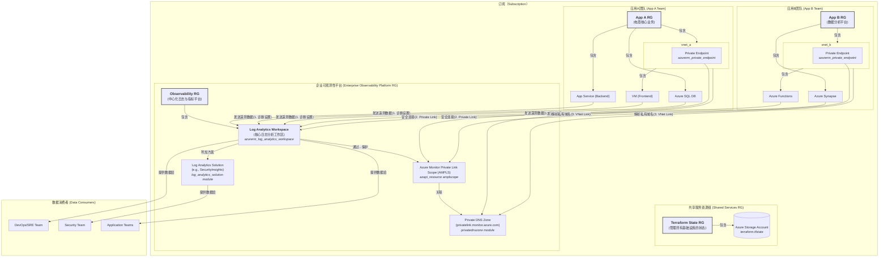
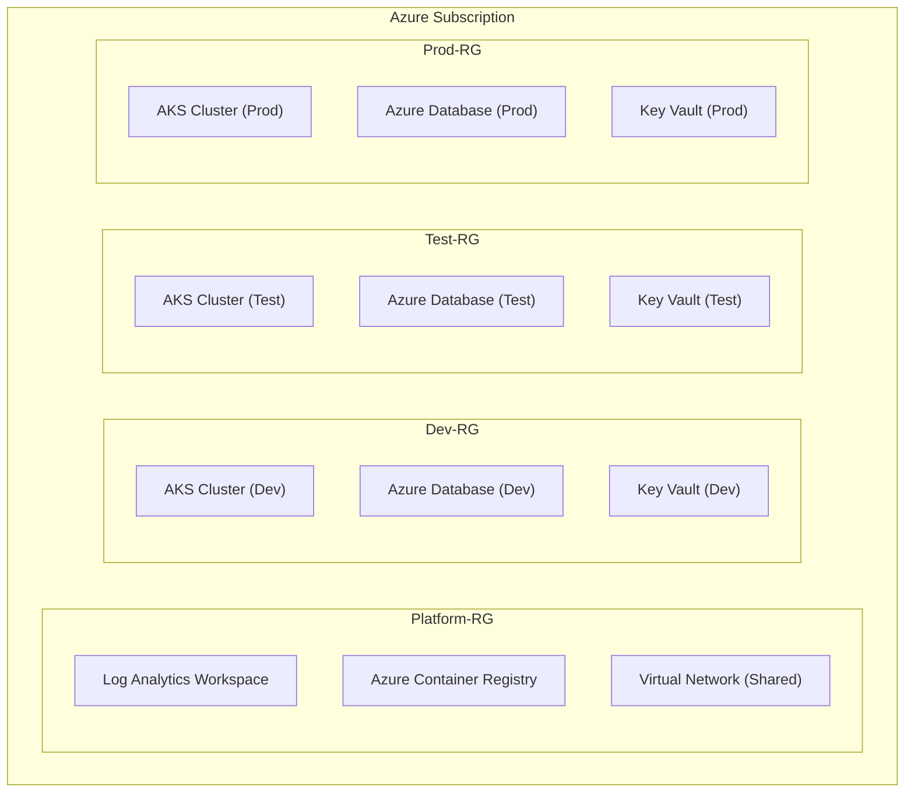
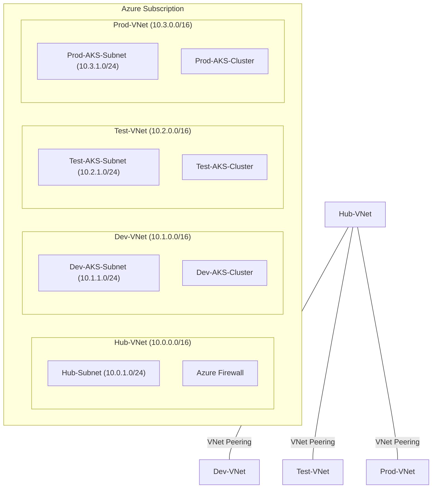
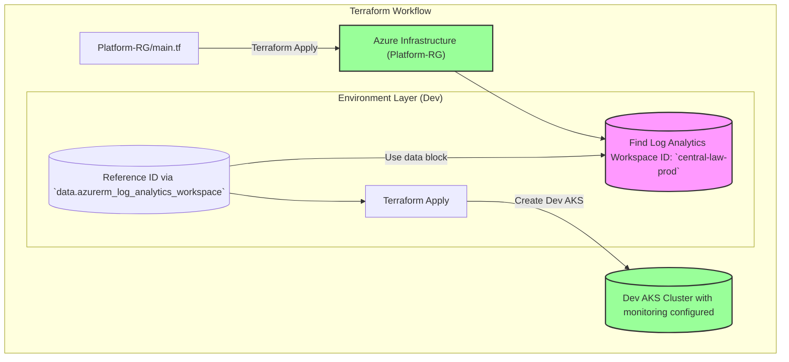

参考资料: [terraform-azurerm-avm-res-operationalinsights-workspace](https://github.com/azure/terraform-azurerm-avm-res-operationalinsights-workspace/tree/v0.4.2)

Question: \

> 在这个[lecture](Source-Materials/Transcripts/Section-6/Lecture-65_Whiteboard-Compartmentalizing-Shared-Services-like-Observability.md)中，instructor阐述了什么？请你将这个lecture中提及的 logical entity 之间的关系梳理清晰。

---

Answer: \

````md
在这个[讲座](Source-Materials/Transcripts/Section-6/Lecture-65_Whiteboard-Compartmentalizing-Shared-Services-like-Observability.md)中，讲师主要阐述了**资源组（Resource Group）**、**Terraform状态（TF State）**、**Observability Stack（可观测性堆栈，包括日志、指标、告警等）**之间的关系，以及它们在 Azure 基础设施中的分组和共享模式。

### 主要逻辑实体及关系梳理

#### 1. 资源组（Resource Group）

- 是 Azure 中用于组织和管理资源的逻辑容器。

- 可以根据不同的用途（如 TF State、Observability、应用工作负载等）进行分组。

#### 2. Terraform 状态（TF State）

- 通常会单独放在一个资源组（如专门的 TF State 资源组），用于存储 Terraform 的状态文件（如存储账户）。

- 这个资源组是**共享服务**，多个项目/工作负载都可以复用这个状态存储。

#### 3. Observability Stack（可观测性堆栈）

- 包括日志、指标、告警等，通常由 Log Analytics Workspace 及相关服务组成。

- 讲师建议将 Observability Stack 单独放在一个资源组，作为**共享服务**，而不是直接放在某个应用的资源组里。

- 这样做的好处是可以让多个应用/服务共享同一个可观测性堆栈，便于统一管理和跨应用分析。

#### 4. 应用/工作负载（Application/Workload）

- 每个应用可以有自己的资源组，也可以有自己的 Observability Stack（如日志、指标只针对某个应用）。

- 但随着应用复杂度提升，通常会让多个组件（如前端、数据库、微服务等）共享同一个 Observability Stack。

#### 5. 企业级视角（Enterprise-wide）

- 在更高层面，可以有一个企业级的 Observability Stack，聚合所有应用和服务的日志、指标等，供企业架构师、安全团队、运维团队等使用。

### 关系总结

- **TF State 和 Observability Stack 都是共享服务**，通常单独分组，供多个项目/应用复用。

- **Observability Stack 可以有多种分组方式**：既可以按应用隔离，也可以企业级聚合，具体取决于管理和分析需求。

- **资源组的分组方式影响 Observability 的复用和分析能力**：过度分散会降低整体可观测性，合理分组有助于统一视角和管理。

---

**结论：**  

讲师强调了将共享服务（如 TF State、Observability Stack）单独分组的最佳实践，并说明了不同分组方式的适用场景和权衡。这样做有助于提升基础设施的可管理性和可观测性。
````

---

结合我刚才给你的Github Repository链接，请你给我一个real world的enterprise中的observability的resource group与其他project/app之间的关系图。

---

好的，我们结合您提供的 `terraform-azurerm-avm-res-operationalinsights-workspace` 这个企业级的 Terraform 模块，来绘制一幅真实世界中企业级可观测性（Observability）资源组与其他项目/应用关系的架构图。

这个模块的设计本身就体现了企业级的最佳实践，即将 **Log Analytics Workspace** 作为一个核心的、可被多个应用共享的服务来部署。

-----

### 企业级可观测性平台关系图

以下是基于您提供的 GitHub Repository 中的实践，绘制的关系图。



-----

### 关系解读与分析

这张图清晰地展示了一个典型的企业级云架构，其中的逻辑关系与您提供的 Terraform 模块 (`terraform-azurerm-avm-res-operationalinsights-workspace`) 的设计思想完全一致。

1.  **中心化的可观测性平台 (Observability Platform RG)**

      * **核心**: 所有遥测数据（日志、指标、追踪）都汇集到位于独立资源组 `Observability RG` 中的**Log Analytics Workspace (LAW)**。这与 `main.tf` 中定义的 `azurerm_log_analytics_workspace` 资源相对应。
      * **目的**: 创建一个单一事实来源（Single Source of Truth），便于 DevOps、SRE 和安全团队进行统一的监控、告警、故障排查和成本分析。
      * **扩展性**: 您可以轻松地为这个中心化的 LAW 添加解决方案（Solutions），例如为安全团队添加 `SecurityInsights`，而无需改动任何应用。这对应了 `modules/log_analytics_solution` 子模块。

2.  **应用资源组与可观测性平台的连接 (The Connection)**
    应用（如 App A, App B）与中心化的可观测性平台之间通过三种关键机制连接，这些都在您提供的代码示例中有体现：

      * **(1) 诊断设置 (Diagnostic Settings)**:

          * 这是数据流动的**逻辑连接**。每个 Azure 资源（如 VM, App Service, SQL DB）都可以通过“诊断设置”将其日志和指标指向中心化的 LAW。
          * 在 Terraform 中，这通常在各个资源的定义中通过设置 `workspace_resource_id` 来实现，这与 `variables.tf` 中的 `diagnostic_settings` 变量设计理念一致。

      * **(2) 私有链接 (Private Link)**:

          * 这是数据流动的**网络连接**，确保安全。为了避免遥测数据通过公共互联网传输，应用所在的虚拟网络（VNet）中会创建一个**私有端点 (Private Endpoint)**。
          * 这个私有端点连接到 `Observability RG` 中的 **Azure Monitor Private Link Scope (AMPLS)**。这完全对应了 `examples/deploy_network_isolation/main.tf` 中的场景，其中 `azurerm_private_endpoint` 和 `azapi_resource "amplscope"` 是关键资源。

      * **(3) VNet Link 与 Private DNS Zone**:

          * 为了让应用网络内的资源能够正确解析私有端点的 IP 地址，应用的 VNet 需要链接到 `Observability RG` 中的**私有 DNS 区域 (Private DNS Zone)**。
          * 这确保了当应用尝试连接 `*.monitor.azure.com` 时，DNS会将其解析为内部私有 IP，而不是公共 IP。这对应了 `examples/deploy_network_isolation/main.tf` 中 `privatednszone` 模块的使用。

3.  **独立的 Terraform 状态资源组 (Terraform State RG)**

      * 虽然不是可观测性的核心，但图中也包含了另一个重要的共享服务：**Terraform State 资源组**。
      * 将 `tfstate` 文件存储在独立的、高权限管理的存储账户中，是企业级 IaC 的标准实践，确保了状态文件的安全与一致性。

**结论**:
您提供的这个 Terraform AVM (Azure Verified Module) 是一个完美的“现实世界”企业级范例。它不仅仅是创建一个 Log Analytics Workspace，更重要的是，它通过其变量、子模块和示例，完整地定义了一套**安全、可扩展、中心化**的可观测性平台架构。上图就是这个优秀实践的具象化体现，展示了应用如何作为“消费者”，安全地将遥测数据发送到这个中心平台，以供不同团队分析和使用。

---

参考资料: \
- [Terraform-Azure-Useful-References](Notes/Terraform-Azure-Useful-References.md)
- [microservices-demo](https://github.com/googlecloudplatform/microservices-demo)

**Question**: \
> 这个microservices-demo repository，如果你要把这些微服务部署在Azure上，你会怎么部署？
> 
> 请你参考文件`Terraform-Azure-Useful-References.md`中的"Azure Verified Modules"和"Design a Log Analytics workspace architecture"这2个链接，思考一下，我们需要在Azure上对microservices-demo的服务进行集中式的监控以及实施可观察性的工作。
> 
> 另外，针对microservices-demo这一套微服务，我们需要有3套环境，分别是"dev", "test", "prod"。
> 
> 在Azure Verified Modules中是否有什么现成的module可以拿来部署这些微服务以及observability stack？对于observability stack的具体组件，请你优先考虑Azure自身native的服务，我们先从简单的approach开始进展工作，以后如果我们需要实现multi-cloud的服务时再考虑使用第三方的observability 组件。但是，你再设计部署方案时，要考虑到将来的可扩展性，切记Terraform是存在immutability这个特性的，不要出现小小的改动就要把整个服务重新部署的情况。

---

对于如何在 Azure 上使用 Terraform 部署微服务并实施可观察性，并考虑到多环境（dev, test, prod）的需求，可以参考以下部署方案。此方案优先使用 Azure 原生服务和 [Azure Verified Modules (AVM)](https://azure.github.io/Azure-Verified-Modules/overview/introduction/) 中的现成模块，以实现可扩展且高效的部署。

### 1\. 微服务部署方案

鉴于 `microservices-demo` 是一个微服务架构，推荐使用 **Azure Kubernetes Service (AKS)** 或 **Azure Container Apps** 作为部署平台。这两者都非常适合容器化微服务的部署和管理。

  * **Azure Verified Modules (AVM) 的应用**
      * **AKS 部署**：AVM 提供了用于部署生产级 AKS 集群的模式模块。例如，[`terraform-azurerm-avm-ptn-aks-production`](https://www.google.com/search?q=%5Bhttps://github.com/Azure/terraform-azurerm-avm-ptn-aks-production%5D\(https://github.com/Azure/terraform-azurerm-avm-ptn-aks-production\)) 模块可以部署一个符合生产标准、包含虚拟网络和 Azure Container Registry 的 AKS 集群。这个模块符合微软的最佳实践，并为企业级部署提供了更高的抽象和更好的默认配置。
      * **优点**：使用 AVM 模块可以确保部署的 AKS 集群遵循 Azure Well-Architected Framework (WAF) 的原则，从而在安全性、性能和成本管理方面达到最佳实践。

### 2\. 可观察性 (Observability) 堆栈部署方案

为了实现集中式监控，我们将采用以 **Azure Monitor** 为核心的 Azure 原生服务。

  * **核心组件**

    1.  **Log Analytics Workspace**：这是所有日志和指标数据的中央存储和分析平台。我们可以为所有环境（dev, test, prod）部署一个或多个 Log Analytics Workspace。
    2.  **Application Insights**：作为 Azure Monitor 的一部分，它专门用于监控微服务的性能和可用性。Application Insights 可以收集应用程序的遥测数据，包括请求率、响应时间、异常和依赖项调用。
    3.  **诊断设置 (Diagnostic Settings)**：这是将 Azure 服务（如 AKS、Azure Container Registry 等）的日志和指标路由到 Log Analytics Workspace 的关键配置。

  * **分层设计与可扩展性**

      * **集中式 vs. 分布式 Log Analytics Workspace**：为了管理 `dev`, `test`, `prod` 这三个环境，可以采取两种设计模式：
          * **集中式**：使用一个或几个 Log Analytics Workspace 来收集所有环境的日志。这简化了跨环境的分析，但可能需要更精细的 RBAC 控制。
          * **分布式**：每个环境都有自己独立的 Log Analytics Workspace。这简化了权限管理，并使环境之间的隔离更清晰。
      * **Terraform 部署**：
          * AVM 提供了 `avm/res/operational-insights/workspace` 资源模块，专门用于部署 Log Analytics Workspace。
          * AVM 还提供了 `avm/res/insights/diagnostic-setting` 模块，用于配置资源的诊断设置，将日志和指标发送到 Log Analytics Workspace。

### 3\. 部署方案和 Terraform 最佳实践

为了解决小改动导致整个服务重新部署的问题（即 Terraform 的 `immutability` 特性），建议采用以下方法：

  * **分层 Terraform 架构**：将基础设施代码分成逻辑上独立的层。
      * **平台层**：部署跨环境共享的基础设施，如网络、身份认证和**一个或多个 Log Analytics Workspace**。这部分通常变动较少。
      * **环境层**：部署每个环境独有的基础设施，如 `dev`, `test`, `prod` 的 AKS 集群、数据库等。
      * **应用层**：仅部署应用程序相关的资源，如 Kubernetes 的 `Deployments`, `Services` 和 `Ingresses`。这部分变动最频繁，但不会影响到下层的基础设施。
  * **使用 Terraform Workspace 或目录结构**：为每个环境 (`dev`, `test`, `prod`) 使用独立的 Terraform workspace 或目录，确保环境之间的隔离，避免意外修改。
  * **数据源 (Data Sources)**：利用 Terraform 的 `data` 块引用已部署的基础设施资源（如 Log Analytics Workspace 的 ID），而不是在每个应用层模块中重新部署它们。这避免了因底层基础设施的微小改动而触发上层资源的重新部署。

**部署流程概述：**

1.  **部署平台层**：使用 AVM 模块部署 Log Analytics Workspace。
2.  **部署环境层**：为 `dev`, `test`, `prod` 三个环境分别部署 AKS 集群，并使用 AVM 模块配置 AKS 的诊断设置，将其日志发送到第一步创建的 Log Analytics Workspace。
3.  **部署应用层**：为每个环境部署微服务容器。由于应用层与基础设施层分离，对微服务的任何更新（如新版本镜像）都只会触发应用层资源的变动，而不会影响 AKS 集群本身。

这种分层方法利用了 AVM 的标准化和最佳实践，确保了部署的稳定性、一致性和可扩展性，同时避免了不必要的重复部署，很好地解决了您对 Terraform immutability 的担忧。

---

Question: \
> "部署应用层"也是通过Terraform来操作的吗？

「部署应用层」通常**不建议**完全通过 Terraform 来操作，尤其是在需要频繁更新的微服务场景下。虽然 Terraform 确实可以部署 Kubernetes 资源（例如 Deployment、Service），但这会带来一些维护上的挑战：

* **Immutable Infrastructure 特性**：Terraform 的核心思想是声明式和不可变基础设施（Immutable Infrastructure）。当您在 Terraform 代码中更改一个容器镜像版本号时，Terraform 会认为整个 Kubernetes `Deployment` 资源发生了变化，并可能触发重新创建，这可能导致服务的短暂中断。这与微服务频繁更新和滚动部署的需求相悖。
* **责任分离**：基础设施（Infrastructure）和应用程序（Application）的变更周期通常是不同的。基础设施（例如 AKS 集群、数据库）通常是稳定且变动较少的，由平台团队或 SRE 负责管理。而应用程序（微服务）则需要由开发团队频繁迭代和部署。如果将应用层也纳入 Terraform 管理，会混淆这两个角色的职责，并可能导致部署流程复杂化。

### 推荐的部署方案

为了解决这些问题并保持高效的 CI/CD 流程，更好的做法是 **将 Terraform 专注于基础设施的部署**，而将 **应用层的部署交给 Kubernetes 原生的工具**。

1.  **Terraform 负责基础设施层**：
    * 部署 AKS 集群、Azure Container Registry (ACR)、Log Analytics Workspace、网络等。
    * 为每个环境 (`dev`, `test`, `prod`) 创建独立的 Terraform 状态和模块。
    * 这部分代码的变动较少，通常在项目启动或重大架构调整时进行。

2.  **应用层使用 Kubernetes 工具**：
    * **CI/CD 管道**：使用 GitLab CI/CD、GitHub Actions 或 Azure DevOps 等工具，构建和打包微服务镜像，并推送到 ACR。
    * **Kubernetes Manifests/Helm**：使用 YAML 文件（Kubernetes manifests）或 [Helm Chart](https://helm.sh/) 来定义微服务的 Deployment、Service 和 Ingress 规则。
    * **GitOps (推荐)**：使用 Flux CD 或 Argo CD 等 GitOps 工具。这些工具会持续监控 Git 仓库中的应用层配置（Helm Chart 或 YAML 文件），当有新的提交时，它们会自动将变更同步到 AKS 集群中，实现自动化和声明式的应用部署。

这种方案实现了**基础设施即代码（IaC）**和**配置即代码（CaC）**的完美结合。Terraform 专注于管理稳定的底层平台，而 GitOps/Helm 则高效且安全地处理频繁的微服务部署，从而实现了良好的职责分离和可扩展性。

---

Question: \
> > 环境层：部署每个环境独有的基础设施，如 dev, test, prod 的 AKS 集群、数据库等。
> 
> 这段话具体到Azure 的Resource Group上来说会是怎样的diagram？

根据您对“环境层”部署的描述，我们可以将其具体化为一个 Azure 资源组（Resource Group）的架构图。这种分层和隔离的设计是基础设施即代码（IaC）的最佳实践之一，它有助于管理权限、追踪成本和确保环境之间的一致性。

### 资源组架构图

下图展示了如何使用 Azure 资源组来为 `dev`、`test` 和 `prod` 三个环境部署各自独立的基础设施。同时，还包含了一个用于存放共享资源的“平台层”资源组。



### 图解和设计考量

  * **Azure Subscription (Azure 订阅)**：所有资源组都位于同一个 Azure 订阅下。如果需要更强的隔离性（例如，为了满足合规性要求），`prod` 环境也可以放在单独的订阅中。
  * **Platform-RG (平台资源组)**：这个资源组包含了在所有环境中共享的资源。
      * **Log Analytics Workspace**：为了实现集中式监控，Log Analytics Workspace 通常作为共享资源部署，用于接收所有环境的日志和指标。
      * **Azure Container Registry (ACR)**：用于存储所有微服务镜像的中央仓库，以确保所有环境都使用相同的镜像来源。
  * **Dev-RG, Test-RG, Prod-RG (环境资源组)**：每个环境都有其独立的资源组，这带来了诸多优势：
      * **隔离性**：物理上将不同环境的资源隔离开来，防止一个环境的变更意外影响到另一个环境。
      * **权限管理**：可以为每个资源组设置独立的访问控制（RBAC），例如，只允许开发团队访问 `Dev-RG`，而只有 SRE 团队才能访问 `Prod-RG`。
      * **成本管理**：通过资源组可以清晰地追踪每个环境的成本，方便进行预算和资源优化。
      * **生命周期管理**：可以轻松地管理整个环境的生命周期。例如，如果需要，可以快速删除 `Dev-RG` 以清理所有开发环境资源。

这种架构确保了每个环境都有其所需的独立组件，同时又能够通过共享的平台资源（如监控和镜像仓库）实现统一的管理和可观察性。

---

Question: \
> 按照你上面给出的diagram来看，dev, test, prod的AKS的Kubernetes节点所使用的CIDR应该是互相不重复的，但是这3个Kubernetes集群之间可以做到node与node之间网络相通？

根据您提出的问题，dev、test、prod 的 AKS 集群节点所使用的 CIDR 块确实需要**互相不重复**，但这三个集群的节点之间**可以实现网络互通**。

这通常是通过在 Azure 中使用 **Hub-and-Spoke** 网络拓扑，并结合**VNet 对等连接 (VNet Peering)** 来实现的。

### 具体实现方案

1.  **Hub-and-Spoke 拓扑**：

      * **Hub (中心) VNet**：创建一个中央虚拟网络（Hub VNet），用于部署共享服务，例如：
          * **Azure Firewall**：作为出站流量的集中式防火墙。
          * **VPN Gateway / ExpressRoute Gateway**：用于与本地网络连接。
          * **Log Analytics Workspace**：您在之前的问题中提到的集中式监控服务。
      * **Spoke (辐条) VNet**：为每个环境（dev、test、prod）创建独立的虚拟网络（Spoke VNet）。每个 AKS 集群和其关联的子网都部署在各自的 Spoke VNet 中。这些 Spoke VNet 的 CIDR 块必须是唯一的，以避免 IP 地址冲突。

2.  **VNet 对等连接 (VNet Peering)**：

      * 在 **Hub VNet** 和每个 **Spoke VNet** 之间建立 VNet 对等连接。
      * 在配置对等连接时，需要确保\*\*“允许流量转发”（Allow forwarded traffic）**和**“允许网关传输”（Allow gateway transit）\*\*等选项被正确启用。
      * 通过这种方式，部署在不同 Spoke VNet 中的 AKS 集群节点之间，以及它们与 Hub VNet 中的共享服务之间，都能够通过 Azure 的骨干网络进行路由，实现无缝的网络通信。

### 架构图

以下 Mermaid 图展示了这种 Hub-and-Spoke 架构如何实现不同环境 AKS 集群间的网络互通。



**总结**：通过将每个 AKS 集群部署在独立的 Spoke VNet 中（确保各自的 CIDR 不重复），并通过 VNet 对等连接将所有 Spoke VNet 连接到中央 Hub VNet，您可以同时实现环境的隔离和必要的跨环境网络通信，从而满足您的需求。

---

Question: \
> 如果我的prod 的AKS承受不了服务负载，怎么办？

这是一个非常好的问题。在微服务架构中，处理突发流量或持续增长的服务负载是核心挑战之一。如果生产环境的 AKS（Azure Kubernetes Service）集群无法承受负载，我们需要采取**弹性伸缩（Scaling）**的策略。

弹性伸缩主要分为两个层面：

### 1. 应用程序层面的伸缩（Horizontal Pod Autoscaling, HPA）

这一层面的伸缩是针对您的微服务（Pod）本身。当单个服务实例的负载过高时，Kubernetes 会自动增加该服务的 Pod 数量。

* **工作原理**：您可以在 Kubernetes 配置中为每个微服务定义一个 `HorizontalPodAutoscaler` 资源。它会监控 Pod 的 CPU 使用率、内存使用率或其他自定义指标。
* **如何配置**：
    * 在您的 `Deployment` 或 `ReplicaSet` 定义中，为容器设置资源请求（`resources.requests`）和限制（`resources.limits`）。这是 HPA 衡量指标的基础。
    * 创建一个 `HorizontalPodAutoscaler`，指定目标 CPU 使用率（例如，`targetCPUUtilizationPercentage: 80`）以及 Pod 的最小和最大副本数（`minReplicas` 和 `maxReplicas`）。
* **优点**：可以快速响应应用程序负载的变化，确保每个服务都有足够的实例来处理请求。

**示例**：当某个微服务的 CPU 使用率超过 80% 时，HPA 会自动增加 Pod 数量，最高增加到 10 个副本。

### 2. 基础设施层面的伸缩（Cluster Autoscaler）

如果应用程序层的 Pod 数量增加，而集群中的节点（即虚拟机）资源已经不足以容纳更多 Pod 时，就需要集群层面的伸缩。

* **工作原理**：**Cluster Autoscaler** 是 AKS 的一项内置功能。它会监控集群中所有 Pod 的状态。当它发现有 Pod 因为资源不足（例如，CPU 或内存）而处于“Pending”状态时，会自动向 AKS 所在的 Azure 虚拟机规模集（Virtual Machine Scale Sets）发出请求，增加新的节点来满足 Pod 的资源需求。
* **如何配置**：
    * 在创建或更新 AKS 集群时，启用 **Cluster Autoscaler** 功能，并设置每个节点池（Node Pool）的最小和最大节点数。
    * 当节点使用率较低时，Cluster Autoscaler 也会自动移除空闲节点，以节省成本。
* **优点**：确保了集群始终有足够的计算资源来承载应用程序，并且可以动态调整节点数量以优化成本。

### 综合解决方案（HPA + Cluster Autoscaler）

一个完整的弹性伸缩方案通常是结合使用 HPA 和 Cluster Autoscaler。这个过程可以被描述为：

1.  **流量激增**：您的 `microservices-demo` 流量突然增加。
2.  **HPA 响应**：各个微服务的 Pod CPU 使用率上升，HPA 侦测到后，自动增加 Pod 数量来分担负载。
3.  **Cluster Autoscaler 响应**：随着 Pod 数量的增加，现有的 AKS 节点资源被耗尽，新的 Pod 无法被调度。Cluster Autoscaler 侦测到这些处于“Pending”状态的 Pod，自动向节点池中添加新的虚拟机节点。
4.  **负载恢复**：新的节点加入集群后，这些 Pod 被成功调度和启动，整个服务集群恢复正常运行，继续处理激增的流量。

通过这种双重伸缩机制，您的 `prod` 环境的 AKS 集群能够做到**“自动扩容以应对峰值，自动缩容以节省成本”**，从而确保服务的稳定性和可用性。

---
**Question**: \

> > 数据源 (Data Sources)：利用 Terraform 的 data 块引用已部署的基础设施资源（如 Log Analytics Workspace 的 ID），而不是在每个应用层模块中重新部署它们。这避免了因底层基础设施的微小改动而触发上层资源的重新部署。
> 
> 你之前提到的这段话，对我来说有点抽象，脑海中无法复现一个diagram。请你再详细解释一下。这个"数据源"的"问题"是什么？换句话说，在Terrafrom中使用`data` block是为了解决怎样的问题？

`data` 块是 Terraform 中一个非常重要的概念，它主要用于解决**资源间依赖和信息传递**的问题，尤其是在基础设施被分层管理时。

为了更好地理解这个概念，我们可以从你提到的问题出发：

**问题：** 为什么不直接在应用层模块中部署 Log Analytics Workspace，而要使用 `data` 块引用它？

### 1\. 传统方式（不使用 `data` 块）的问题

想象一下，如果你在每个环境层（`dev`, `test`, `prod`）的 Terraform 代码中，都直接定义一个 Log Analytics Workspace 资源。

```terraform
# dev 环境的 main.tf
resource "azurerm_log_analytics_workspace" "dev_law" {
  name                = "law-dev"
  resource_group_name = "Dev-RG"
  location            = "eastasia"
  sku                 = "PerGB2018"
}

# test 环境的 main.tf
resource "azurerm_log_analytics_workspace" "test_law" {
  name                = "law-test"
  resource_group_name = "Test-RG"
  location            = "eastasia"
  sku                 = "PerGB2018"
}
...
```

这种做法会导致以下问题：

  * **重复定义**：Log Analytics Workspace 实际上是一个平台级的共享资源，所有环境都应该使用同一个中央服务。将它分别定义在每个环境的配置中，导致了代码重复，难以维护。
  * **不必要的耦合**：你的应用层模块会和 Log Analytics Workspace 的具体部署细节（如名称、ID 等）紧密耦合。如果未来需要改变 Log Analytics Workspace 的 SKU 或其他属性，你就需要修改所有环境的配置文件，这会大大增加工作量和出错的风险。
  * **部署风险**：在 Terraform 中，如果你对一个已部署的资源进行了微小改动，它可能会触发重新部署。如果 Log Analytics Workspace 位于应用层模块中，当应用层模块被频繁更新时，可能会意外地触发 Log Analytics Workspace 的重新部署，这可能会导致数据丢失或服务中断。

### 2\. 使用 `data` 块的解决方案

`data` 块的作用就是**查询**和**引用**已存在的资源。它不会创建任何新资源，而是从 Azure 中获取资源的元数据（如 ID、名称、连接字符串等），并将这些数据暴露给 Terraform 代码使用。

下面是一个使用 `data` 块的示例，它将平台层和环境层的部署进行了分离。

**第一步：平台层部署**

你首先在平台层模块中部署 Log Analytics Workspace。

```terraform
# platform/main.tf
resource "azurerm_log_analytics_workspace" "main_law" {
  name                = "central-law-prod"
  resource_group_name = "Platform-RG"
  location            = "eastasia"
  sku                 = "PerGB2018"
}

output "log_analytics_workspace_id" {
  value = azurerm_log_analytics_workspace.main_law.id
}
```

**第二步：环境层部署（使用 `data` 块引用）**

然后在你的环境层模块中，你通过 `data` 块来**查找**和**引用**这个已经部署好的 Log Analytics Workspace，而不是重新部署它。

```terraform
# dev/main.tf
data "azurerm_log_analytics_workspace" "platform_law" {
  name                = "central-law-prod"
  resource_group_name = "Platform-RG"
}

resource "azurerm_kubernetes_cluster" "dev_aks" {
  # ... 其他 AKS 配置
  resource_group_name = "Dev-RG"
  
  addon_profile {
    oms_agent {
      enabled                    = true
      log_analytics_workspace_id = data.azurerm_log_analytics_workspace.platform_law.id
    }
  }
}
```

### 3\. Diagram

为了更直观地理解，你可以将这个流程想象成以下图表：



**总结：**

使用 `data` 块是为了解决**代码复用和解耦**的问题。它将资源的**创建**和**引用**过程分开，让 Terraform 能够以声明式的方式引用已经存在的资源。这使得你可以独立管理基础设施的不同层级，避免了不必要的重复部署，并提高了代码的可维护性和部署的安全性。

简单来说：

  * **`resource` block**：告诉 Terraform **“请创建这个资源”**。
  * **`data` block**：告诉 Terraform **“请查找并给我这个已存在资源的详细信息”**。