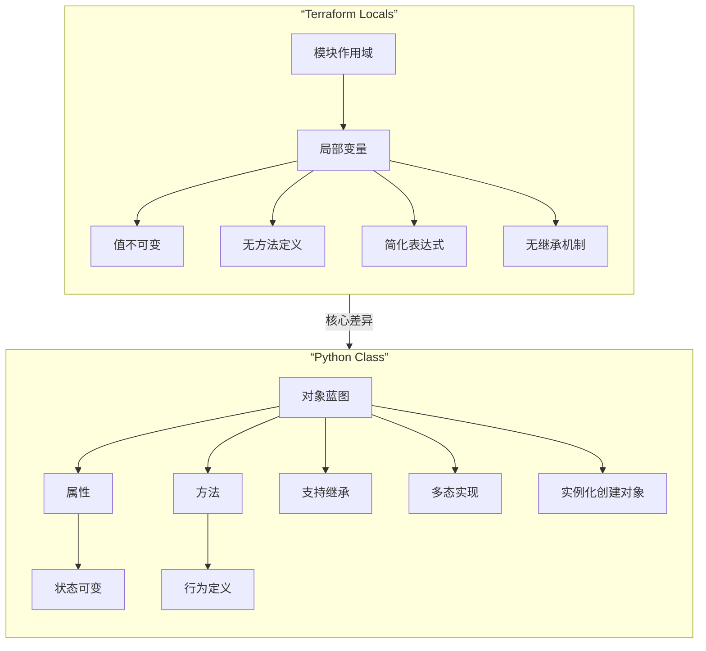

# Terraform Locals 与 Python Class 概念对比



## 关键区别分析
| 特性 | Terraform Locals | Python Class |
|------|------------------|--------------|
| **本质** | 临时计算值容器 | 对象创建模板 |
| **状态** | 不可变 | 可变 |
| **行为** | 无方法定义 | 可定义方法 |
| **作用域** | 模块级别 | 对象实例级别 |
| **复用机制** | 无继承 | 支持继承/多态 |
| **典型用途** | 简化资源配置 | 创建业务对象 |

## 示例对比
```hcl
# Terraform Locals 示例
locals {
  service_name = "web-app"
  instance_count = var.production ? 5 : 2
}
```

```python
# Python Class 示例
class WebService:
    def __init__(self, env="dev"):
        self.service_name = "web-app"
        self.instance_count = 5 if env == "production" else 2
    
    def deploy(self):
        print(f"部署 {self.instance_count} 个 {self.service_name} 实例")
```

## 结论
Terraform Locals **不是**面向对象概念，而是：
- 配置语言的表达式简化工具
- 无状态管理的值容器
- 基础设施即代码(IaC)特有的抽象机制