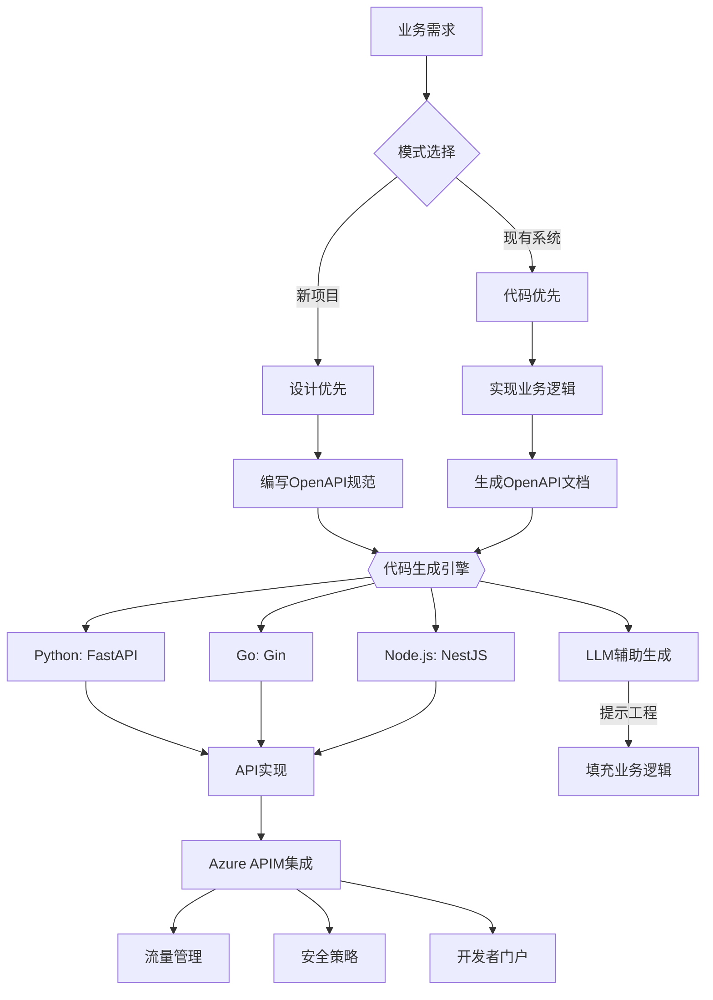
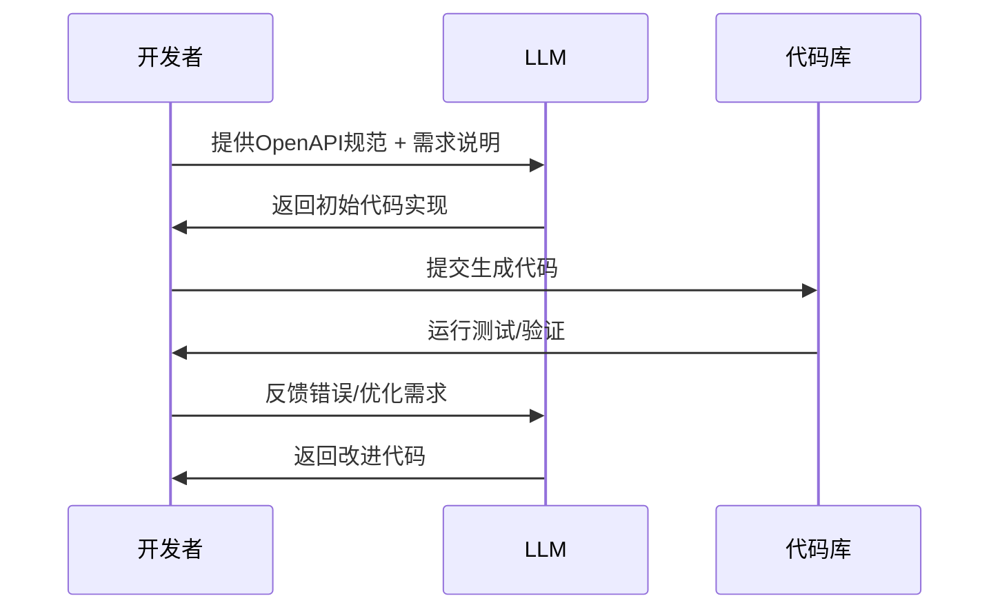

# OpenAPI开发工作流架构

## 整体工作流程图


## 框架集成指南

### Python (FastAPI)
```python
from fastapi import FastAPI
from pydantic import BaseModel

app = FastAPI()

class Item(BaseModel):
    name: str
    price: float

@app.post("/items/")
async def create_item(item: Item):
    return {"item_name": item.name, "price": item.price}
```
- 自动生成OpenAPI路径：`/openapi.json`

### Go (Gin + swag)
```go
// @Summary 创建商品
// @Description 创建新商品
// @Accept  json
// @Produce  json
// @Param   item body Item true "商品信息"
// @Success 200 {object} Item
// @Router /items [post]
func CreateItem(c *gin.Context) {
    var item Item
    c.BindJSON(&item)
    c.JSON(200, item)
}
```
- 生成命令：`swag init -g main.go`

### Node.js (NestJS)
```typescript
import { Controller, Post, Body } from '@nestjs/common';
import { ApiBody, ApiResponse } from '@nestjs/swagger';

class ItemDto {
  name: string;
  price: number;
}

@Controller('items')
export class ItemsController {
  @Post()
  @ApiBody({ type: ItemDto })
  @ApiResponse({ status: 201, type: ItemDto })
  create(@Body() item: ItemDto) {
    return item;
  }
}
```

## EC市场API规范示例
```yaml
openapi: 3.0.0
info:
  title: EC Market API
  version: 1.0.0

paths:
  /products:
    get:
      summary: 获取商品列表
      responses:
        '200':
          description: 商品列表
          content:
            application/json:
              schema:
                type: array
                items:
                  $ref: '#/components/schemas/Product'
                  
components:
  schemas:
    Product:
      type: object
      properties:
        id:
          type: integer
        name:
          type: string
        price:
          type: number
        category:
          type: string
```

## LLM辅助开发工作流


## Azure APIM集成步骤
1. 导入OpenAPI规范
```bash
az apim api import --resource-group my-group \
                  --service-name my-apim \
                  --api-id ec-api \
                  --specification-format OpenApiJson \
                  --specification-url https://api.example.com/openapi.json
```

2. 配置安全策略
```xml
<policies>
  <inbound>
    <validate-jwt header-name="Authorization" failed-validation-httpcode="401">
      <openid-config url="https://login.microsoftonline.com/tenant-id/.well-known/openid-configuration" />
      <audiences>
        <audience>api-client-id</audience>
      </audiences>
    </validate-jwt>
    <rate-limit calls="100" renewal-period="60"/>
  </inbound>
</policies>